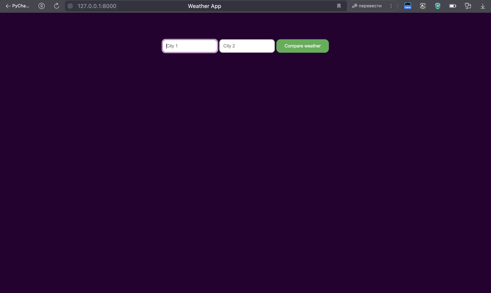

# Weather-Web-App
**Author: Sergei Kalyaev**  
Этой мой первый проект с использованием `Django`

## Описание
Для начала вставляем среду разработки Django 
->  
django-admin startproject `name project`   
python manage.py startapp `name app`  
<-  
Дальше чтобы получать информацию о погоде и опубликововать ее,
Я нашел бесплатный портал, где можно получать информацию
О погоде прямо сейчас, чтобы получать прогнозы нужна подписка
Дальше шла работа с API этого сервиса, я потыкался,
Увидел данные которые хотел опубликововать и начал работу  
Основная работа шла во views.py (получение информацию, ее отправка)
Дальше отображение информации index.html и city_weather.html
Исправление ошибок связанных с Django, API и все готово!
  
## Как запустить
- git clone `url repository`  
- pip install django requests
- cd weather_project
- python manage.py runserver (and click to url (ip-adress))

## Стэк 
- 
- 
- 
- 

## Скрины
  
   
  
